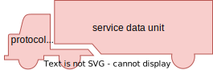

# Packet switching

L'alternativa, che ci interessa perché è come funziona Internet, è la commutazione di pacchetto. È molto simile alla
commutazione per divisione del tempo, ma non determino a priori gli slot di comunicazioni.

Ho dei sistemi, più difficili da realizzare, che cercano di capire qual è lo stato attuale del mezzo di comunicazione
e se possono inviare più o meno dati.

Il **pacchetto** è l'unità fondamentale della comunicazione su Internet. Se voglio inviare un altro pacchetto non dovrò
aspettare nessuno che mi dica che posso inviare un pacchetto, lo potrò fare e basta.

C'è di nuovo una divisione temporale del mezzo di comunicazione, ma lo slot non ha una durata predefinita e imposta.

Inizialmente l'architettura di rete venne vista molto male dai telecomunicanti dell'epoca perché tutto poteva andare
facilmente storto; era facile creare interferenze. Si può ripetere anche ad altri livelli.

**Teoria delle reti di code** - Leonard Kleinrock.

A volte il paradigma packet switching viene definito come multiplexing statistico a suddivisione di tempo.
Come in molti contesti le probabilità fanno nascere proprietà desiderabili nel sistema.

Quando le cose andranno storto parleremo di _collisioni_, malfunzionamenti dovuti a nodi che comunicano nello stesso
momento, e _congestione_ quando i problemi si verificheranno tra nodi intermedi.
Le reti sono composte da host iniziale e finale, collegamenti ed eventualmente nodi intermedi. Più informazioni
possono arrivare sullo stesso nodo condiviso e le cose possono andare storto anche lì.

Ad esempio i router funzionano tramite dei buffer, ricevono dati e li rinviano. La memoria non è infinita e se ricevono
troppe informazioni senza riuscire a inviarli velocemente, a un certo punto il router rifiuterà parte dei dati dalla
sua memoria; qui si parla di congestione.

Il paradigma circuit switching richiede di verificare che le risorse siano disponibili e ci accorgiamo che le risorse
finiscono nel momento della prenotazione stessa.

## Metriche

**Bandwidth** o banda di trasmissione: è la quantità di dati trasmessi per unità di tempo. Si misura come bit per unità
di tempo. Ad esempio `Kbps` ovvero kilobit al secondo (bit, non byte). Nelle reti si usano i bit, di solito, al posto
dei byte che cambia di un fattore moltiplicativo 8.

Esempio e confronto: link a 1 mbps e ciascun utente richiede 0.1 mbps quando trasmette, rimanendo attivo il 10%
del tempo.

Una rete circuit switching supporta al più 10 utenti, mentre in una rete a commutazione di pacchetto il dimensionamento
si basa sul calcolo delle probabilità.

Se consideriamo 35 utenti che trasmettono con probabilità uniforme, la probabilità che più di 10 utenti trasmettano
contemporaneamente bassissima (0.0004). Si possono far comunicare 35 utenti sulla stessa linea con minimi conflitti.
Ovviamente gli eventi di fallimenti non vengono lasciati ingestiti.
Il calcolo della probabilità è un caso di probabilità condizionata.

## Struttura del pacchetto

Ogni pacchetto è costituito da un _protocol control information_ o header, insieme dei metadati necessari al corretto
funzionamento del protocollo stesso e da un _service data unit_ o payload, il vero contenuto informatico scambiato.

Il payload identifica il carico di un camion, in inglese. Il pacchetto trasmette l'SDU in modo opaco, ovvero non gli
interessa cosa va a trasmettere.

PCI + SDU = PDU, ovvero protocol data unit. È sinonimo di pacchetto quando intendo tutto il pacchetto.

Lo stack di protocolli si realizza per incapsulamento del messaggio. Partiamo dall'applicazione che deve trasmettere
un'immagine, ovvero dei dati che ci interessa far arrivare al destinatario.

Il protocollo applicativo, di livello N, aggiunge dei dati per comunicare (aggiungi un protocol control information o
header). Non può comunicare direttamente sul mezzo fisico, per cui il protocollo di livello N-1 prende il pacchetto
ricevuto dall'alto, aggiunge il suo header e lo trasmette al livello inferiore.

Ogni livello si occupa soltanto di quello corrispondente sullo stack dell'altro host. Ogni livello "scarta" il suo PDU
e passa il contenuto al livello successivo.

## Standard de iure

L'organizzazione internazionale di standardizzazione ISO ha definito le specifiche di uno stack di protocolli di rete
ovvero l'OSI (open system interconnection). Nasce come proposta alternativa di IBM a TCP/IP. Ha 7 livelli, a differenza
dei 3/4 di TCP/IP.

Teniamo la nomenclatura dei livelli, per questioni storiche è comodo usarli.

Il livello fisico, o livello 1, è quello che gestisce i particolari a livello di elettronica.

Il livello 2 gestisce i frame trasformando la semplice trasmissione in una linea di comunicazione dove gli errori
vengono rilevati.

A livello 3 siamo già a livello di rete, e si occupa di far comunicare diverse reti. Qui lavorano i router.

Il trasporto, o livello 4, consente di creare comunicazioni tra applicazioni (non più semplicemente fra host).
Questi sono livelli simili a quelli visti prima.

Nell'ISO/OSI vengono architettati altri 3 livelli che nei protocolli standard di oggi non sono inclusi: gestione della
sessione, della presentazione e dell'applicazione.

La sessione fa in modo che venga creato uno stato, ovvero che dei messaggi riguardino uno stesso flusso di
comunicazione.

La presentazione risolve le differenze di formato tra diversi nodi della rete (conversione tra caratteri ASCII, Unicode,
EBCDIC).

Nello stack TCP/IP i primi due livelli sono fusi in _host-to-network_, il secondo layer è chiamato livello 3 perché
risolve i problemi di network della pila ISO/OSI, transport è a livello 4 (nonostante sia al terzo livello) e infine
c'è application. Session e presentation non sono presenti.

Ogni protocollo, nell'ambito del suo funzionamento, interpreta solo l'header relativo al suo livello. Non va a leggere
gli altri header.

Avere uno stack a 7 livelli è più complesso, anche a livello software per gestire le nuove astrazioni e complessità.
Inoltre ogni header aggiunge un overhead sulla quantità di dati che vengono trasmessi.

Ad esempio se devo trasmettere un file da 1 GiB non trasmetterò esattamente 8 Gib ma di più, ad esempio tutti gli header
e altre cose. Inoltre il file viene spezzato in tanti pacchetti, quindi l'impatto non è trascurabile.

TCP/IP sembra meno elegante, ma è più efficace e raggiunge prestazioni migliori.
