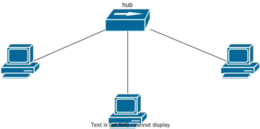
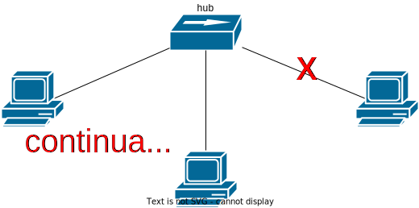

# Architettura delle reti Ethernet

Ci sono tre tipi di dispositivi di rete, possono esserci anche in altre reti a livello Host-To-Network.

- Hub: dispositivo di rete di livello 1. È un ripetitore elettrico che riceve segnali e li propaga soltanto a livello
fisico. Intercetta il preambolo, riesce a capire quando arriva un frame e lo inoltra. Migliorano le reti a bus ma non
riescono a soddisfare le esigenze delle reti moderne, quindi sono deprecati.

- Switch: a livello 2 riescono a leggere il frame Ethernet e inoltrarlo in base alle informazioni trovate all'interno.

- Bridge

Non andiamo a livello superiore perché stiamo parlando di Ethernet (livello H2N). In alcuni contesti si parla anche di
bridge e switch a livello 3.

Switch e bridge si confondono. Bridge identifica una funzionalità, di solito non si _acquista un bridge_, ma è una
funzionalità logica che può fare un nodo della rete.

Gli switch sono i dispositivi fisici che implementano una porzione della funzionalità di bridging.

Questi dispositivi sono pensati per topologie di rete a stella. Ogni nodo connesso fa parte dello stesso segmento di
LAN. L'hub è un centro stella che inoltra tutti i segnali ricevuti su una porta, su tutte le altre porte.

Il protocollo Ethernet **non cambia** anche se cambia la topologia di rete.

I vantaggi legati all'uso dell'hub è legato alle questioni fisiche, ad esempio un collegamento diretto fra nodi limita
la distanza di propagazione del segnale; se uso un hub posso raddoppiare la distanza fisica, inoltre c'è una maggiore
resilienza al guasto: l'hub isola il guasto.

Non otteniamo però miglioramento delle performance perché la probabilità di collisioni è pressoché uguale a un bus
condiviso.

> All'interno di una rete Ethernet si definisce **dominio di collisione** quell'area della rete dove se due o più nodi
comunicano contemporaneamente si verifica una collisione.

Il dominio di collisione definisce quali host non possono _parlare_ contemporaneamente, pena collisioni.

## Switch

Compie un inoltro selettivo dei frame, quindi riduce e spesso elimina anche il dominio di collisione. Adesso gli host
usano un mezzo parzialmente condiviso e si ottengono performance migliori.

Inoltre uno switch Ethernet applica una logica di funzionamento **store-and-forward**, ovvero fa buffering dei frame che
vengono inviati nella sua memoria interna. Memorizzazione => Analisi del frame => Inoltro.

Questo non rende però assolutamente affidabile la rete, perché in un contesto di congestione di un nodo intermedio
la ricezione non è assicurata.

Esistono anche degli switch che usano una logica di funzionamento **cut-through**: lo switch non immagazzina tutto il
frame ma analizza solo la porzione del frame Ethernet appena arriva e li inoltra mentre arrivano.
Si ottengono con architetture hardware specifiche. Il posizionamento del destination MAC in un frame come primo campo è
legato a queste logiche di inoltro avanzato ad alte performance.

Anche se lo switch supporta N connessioni con un certo throughput (1 gbps), bisogna vedere il throughput totale che deve
essere almeno N gbps per assicurare la massima velocità a tutti gli host connessi.

Gli switch hanno due funzionalità principali: filtraggio e inoltro.

### Filtraggio

Lo switch non invia i frame che non sono dedicati a certe porzioni della rete sui corrispondenti segmenti.

### Inoltro

Riguarda il come raggiungere i destinatari. Lo switch inoltra il frame in base al MAC address, mantiene in memoria
un'associazione tra MAC address e porta a cui è collegato l'host. I MAC vengono appresi tramite ispezione del MAC
sorgente quando arriva un frame.

La prima operazione è leggere la destinazione e capire in che porta inoltrare il frame. Se non esiste un record per il
MAC address letto lo switch fa un _fallback_ e si comporta come un hub, inoltra il frame a **tutti** i link.

Lo switch cerca anche di capire chi ha mandato il frame, leggendo il MAC address sorgente e lo mappa sulla porta in cui
lo ha ricevuto.

| Tabella switch |   |
|----------------|---|
| MAC-A          | 1 |
|                |   |
|                |   |

(Siamo nel contesto di una comunicazione Ethernet unicast.)
Il pacchetto di risposta adesso proviene, ad esempio, dall'host B, che viene aggiunto alla tabella dello switch.

| Tabella switch |   |
|----------------|---|
| MAC-A          | 1 |
| MAC-B          | 2 |
|                |   |

Il limite di questo approccio è che se la tabella di inoltro dello switch si può riempire, quindi potrei strutturare la
tabella dello switch come una coda e tolgo i record più vecchi ma non è quello che si fa...

Quello che si fa è che la tabella non viene modificata e ci si comporta come un hub.

[CAM Attack](https://www.cbtnuggets.com/blog/technology/networking/cam-table-overflow-attack-explained)

Se invece arriva un frame broadcast, questo viene inoltrato a tutti. È diverso dal dover inoltrare il pacchetto a tutti
perché non conosce il link legato al MAC address destinazione.

Nel caso di collegamenti full duplex, lo switch elimina quasi completamente le collisioni.

A una porta di uno switch potrebbe essere collegato più di un indirizzo MAC. La corrispondenza non è biunivoca ma 1-n.
Questo capita anche nel caso di vm, dalla stessa interfaccia fisica vengono inviati frame con indirizzi diversi.

## Bridging

Esamina l'header e lo inoltra, ma può supportate più mezzi fisici.

Ci sono due tipologie di bridging: trasparente perché collega due tecnologie fisiche implementano lo stesso sistema di
indirizzamento a livello 2. Il non trasparente invece implementa logiche per "convertire" i protocolli di livello 2,
compresi gli indirizzi hardware.

Una caratteristica fondamentale della CAM è che ogni record ha un TTL, dopo cui il valore viene considerato invalido e
cancellato. Il TTL è importante per avere un meccanismo per svuotare la tabella.

## Limiti di Ethernet

Vengono utilizzati indirizzi flat quindi c'è bisogno di tecniche di broadcast per l'indirizzamento (ARP), limitando il
numero massimo di livelli in uno schema multilivello.

In presenza di loop (cicli) i pacchetti circolano in modo indefinito nella rete. In brevissimo tempo la rete collassa.
Il traffico si accumula esponenzialmente. Ethernet non permette di gestire questa situazione nativamente, quindi
introduciamo un nuovo protocollo Spanning Tree Protocol.

STP è il primo protocollo attivo degli switch, che fino ad ora non hanno fatto nulla. Il protocollo disabilita
selettivamente alcuni link affinché non ci siano loop logici. Una volta che un collegamento attivo non funziona più
viene riabilitato il link. Viene inviato del traffico attivamente per capire questo.

Posso anche sfruttare questi link per fare dispatching dei pacchetti, invece che tenere dei link completamente
disabilitati. Questo però non è possibile con Ethernet.

Concettualmente STP funziona configurando in ogni switch un numero che corrisponde alla priorità di ogni switch.
Si cerca di identificare lo switch a priorità maggiore (root switch). I link disattivati sono quelli che non dovrebbero
condurre al root switch. Uno spanning tree è un albero di copertura completo.

Si ricorre al collegamento di molteplici reti impiegando il livello 3 dello stack TCP/IP.

## Cablaggio strutturato

Si occupa di come stendere fisicamente la rete.
